# 🛒 Bloc Clean Architecture (E-Commerce App)

This project is a simple e-commerce application built with **Flutter**. The main purpose is to demonstrate a **scalable and maintainable architecture** following **Clean Architecture** principles using modern Flutter tools and libraries.

---

## 🚀 Features

- Product listing and product detail pages
- Add to cart functionality
- Fetching data from RESTful API
- Shared Preferences for local storage
- Clean and layered architecture using best practices

---

## 🧰 Tech Stack

| Layer                    | Technology / Library   |
| ------------------------ | ---------------------- |
| **Architecture**         | `Clean Architecture`   |
| **State Management**     | `Bloc`, `Cubit`        |
| **Routing**              | `Go Router`            |
| **Dependency Injection** | `Get It`, `Injectable` |
| **Networking**           | `Dio`                  |
| **Local Storage**        | `Shared Preferences`   |
| **Lint Rules**           | `Very Good Analysis`   |

---

## 🧪 Getting Started

```bash
# Install dependencies
flutter pub get

# Generate injectable files
flutter pub run build_runner build --delete-conflicting-outputs

# Run the app
flutter run
```

## 🔗 Backend API

To run the REST API used in this project, you can check out the following repository:

[ECommerceApi - GitHub Repository](https://github.com/huseyinozkan/ECommerceApi)

## 📸 Screenshots

Here are some screenshots of the application:

### 🔐 Authorization

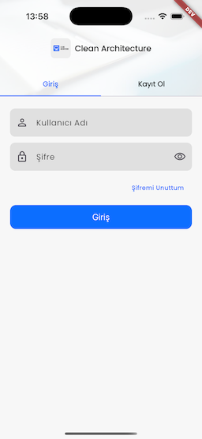
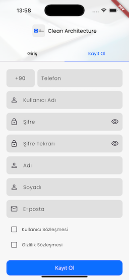
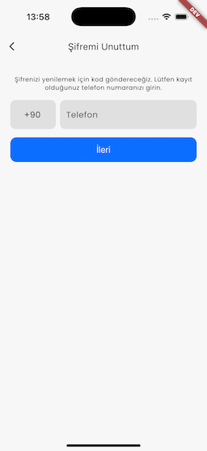

### 🛍️ Product List

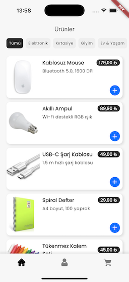

### 🛒 Cart

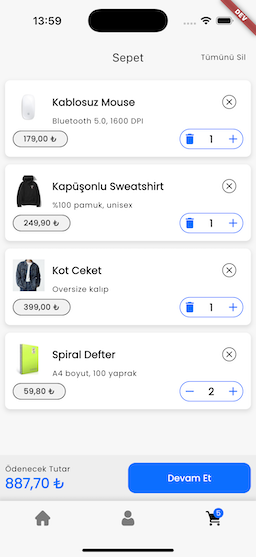
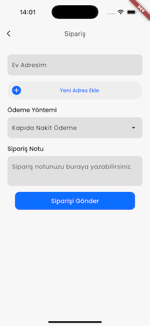

### 👤 Account

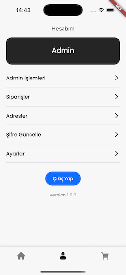

### 📦 Past Orders


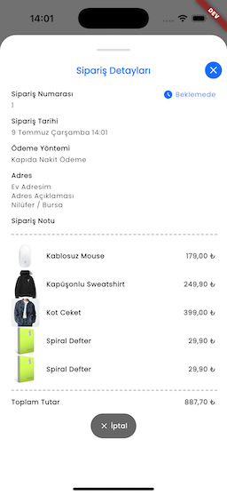

### 🏠 Addresses

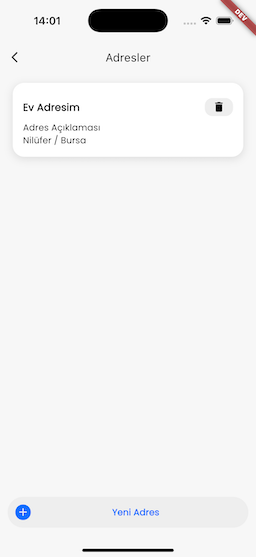

### 🔐 Password Update


### ⚙️ Settings

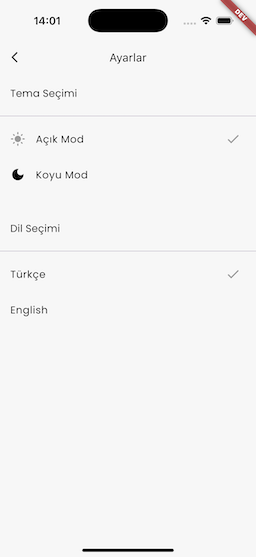

### 🛠️ Admin Panel

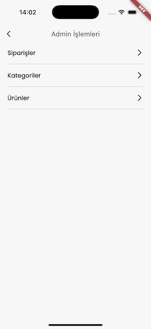

### 📋 Admin Order Management

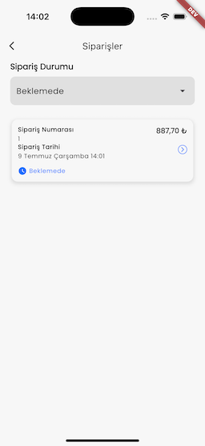
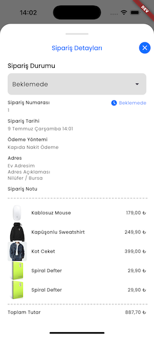
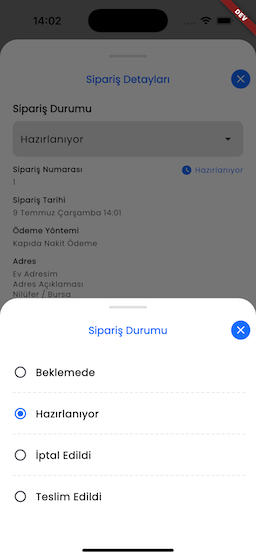

### 🗂️ Admin Category Management

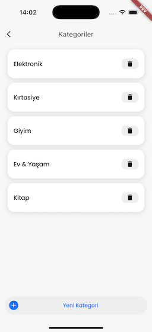

### 🛍️ Admin Product Management

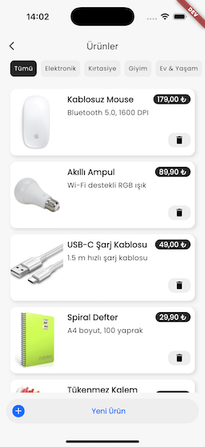
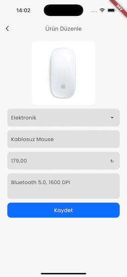
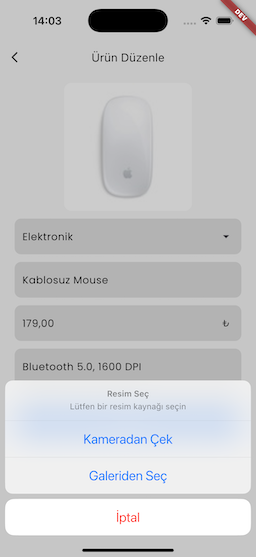
